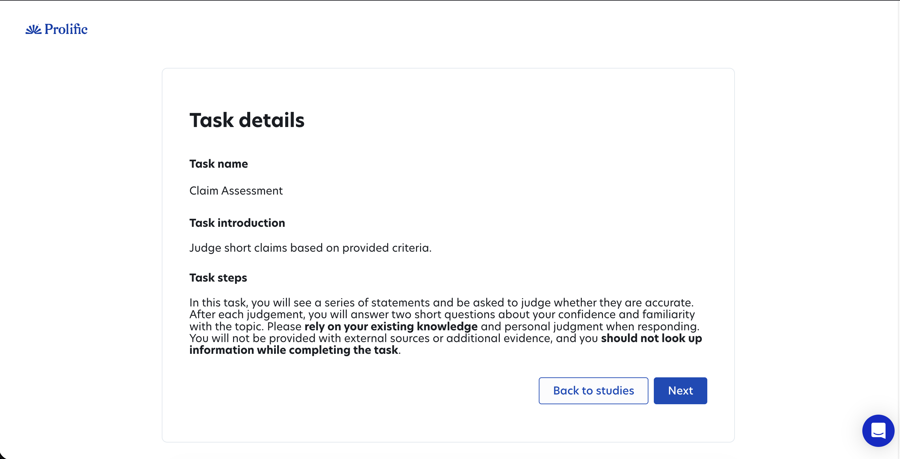
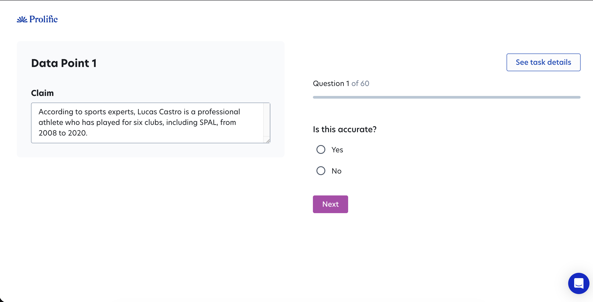
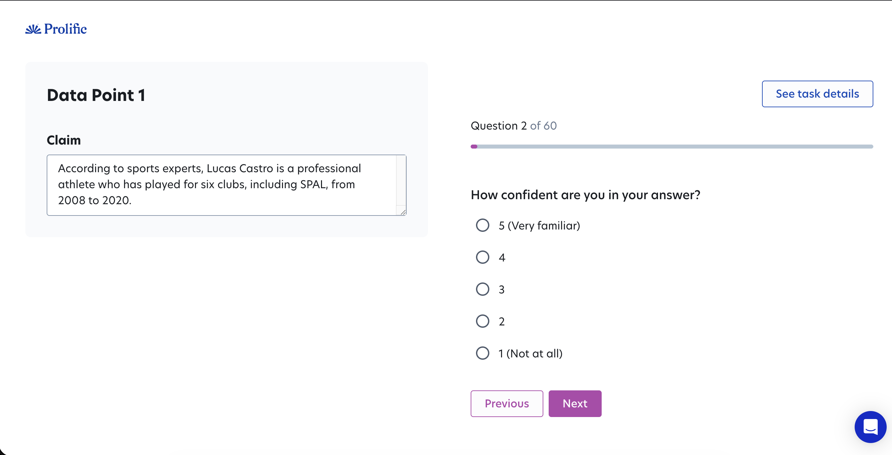
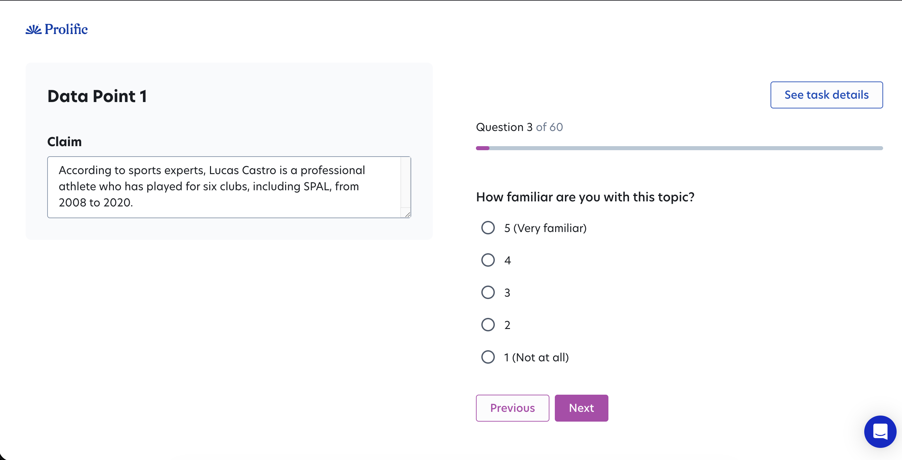

#### Task name

Claim Assessment

#### Task introduction

Judge short claims based on provided criteria.

#### Task steps

In this task, you will see a series of statements and be asked to judge whether they are accurate. After each judgement, you will answer two short questions about your confidence and familiarity with the topic. Please rely on your existing knowledge and personal judgment when responding. You will not be provided with external sources or additional evidence, and you should not look up information while completing the task.

